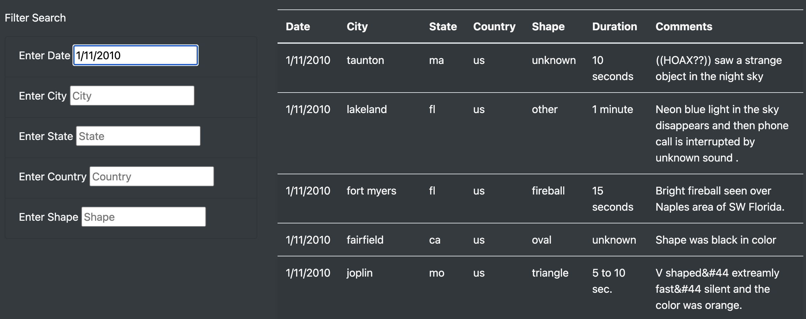
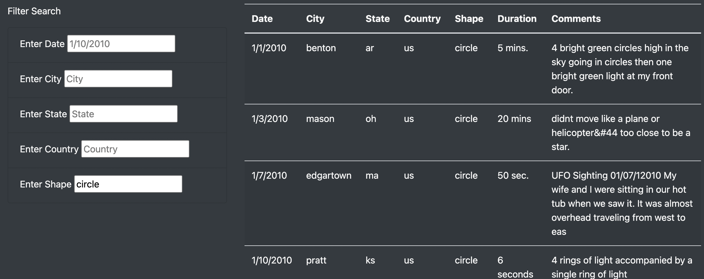
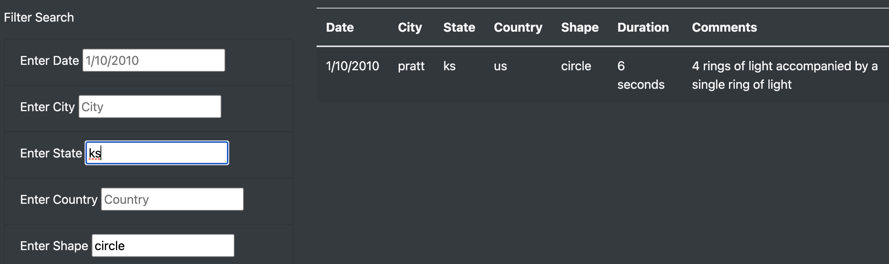

# UFOs
JavaScript and Bootstrap

## Project Overview

Create a webpage and dynamic table to provide a more in-depth analysis of UFO sightings by allowing users to filter for multiple criteria at the same time. Users will be able to filter data for date, city, state, country, and shape. 

1. Create webpage with HTML. 
2. Add style with CSS
3. Use JavaScript and BootStrap to build interactive filters. 

## Resources
- Data Source: data.js
- Software: HTML, CSS, JavaScript, BootStrap, Visual Studio Code, 1.73.0

## Summary/Analysis

### Results:

The UFO Sightings website contains a description of the site and it's purpose. It is formatted with a table and search filter input fields.
The site imports the data.js file which contains UFO sightings in various locations across the US in the month of January 2010. The user can enter one or more filters that corresponds to the descriptions and then hit enter. 

The following image shows the results when a date filter is entered. 

The below image shows the result when a shape is entered.

The user can enter a value for one or all filters. The following information in filtered by state and shape.

Summary:
### Issues:
Currently, the filtering fields are case sensitive.The code needs to be updated to allow for uppercase and lowercase values. Another issue of this site is it's hard to get a good overview of the entire data set. For example, which states are present which are not? 
- 
### Further Recommendations:
The summary addresses two additional recommendations for further development (4 pt)
