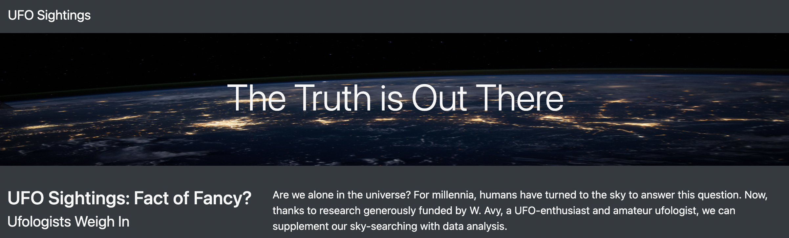

# UFOs
JavaScript and Bootstrap

## Project Overview

Create a webpage and dynamic table to provide a more in-depth analysis of UFO sightings by allowing users to filter for multiple criteria at the same time. Users will be able to filter data for date, city, state, country, and shape. 

1. Create webpage with HTML. 
2. Add style with CSS
3. Use JavaScript and BootStrap to build interactive filters. 

## Resources
- Data Source: data.js
- Software: HTML, CSS, JavaScript, BootStrap, Visual Studio Code, 1.73.0

## Summary/Analysis

### Results:

<a href = "index.html">UFO Sightings</a>
<a href ="https://github.com/cjstreet/UFOs/blob/main/index.html">UFO Sightings</a>
The purpose is well defined (2 pt)

There is a description of how to perform a search, with images. (4 pt)
Summary:
### Issue:
The summary addresses one drawback of this webpage (2 pt)
### Further Recommendations:
The summary addresses two additional recommendations for further development (4 pt)
